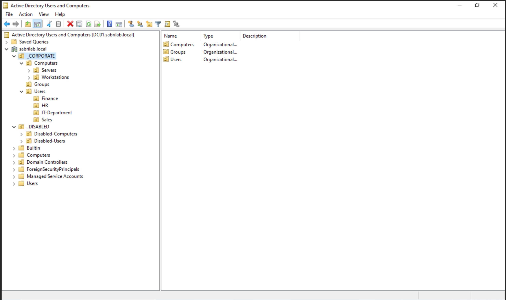
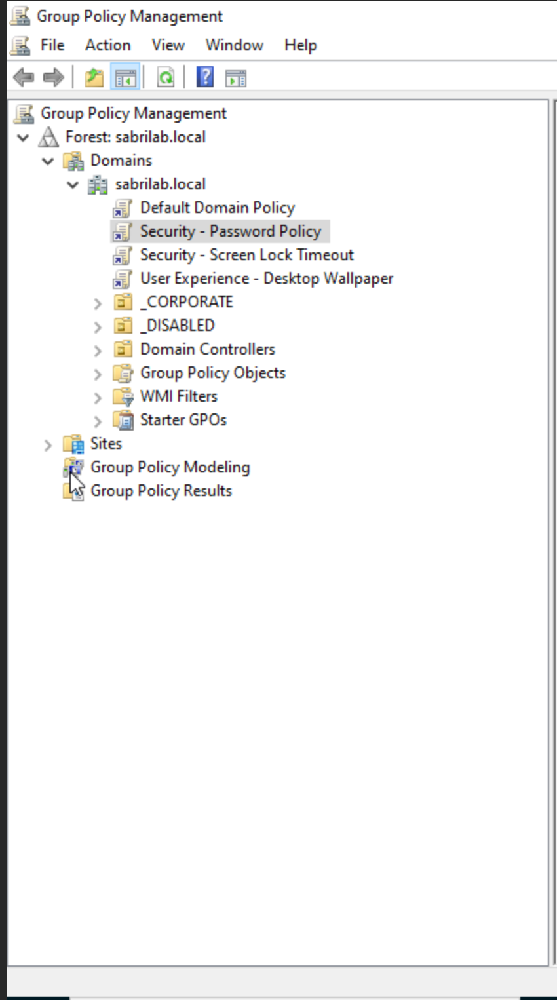
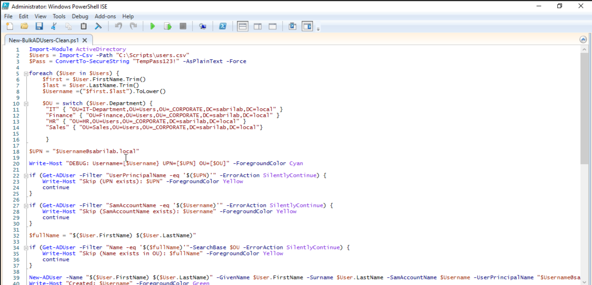

# Active Directory Homelab Project

A complete Active Directory lab environment built from scratch for learning enterprise IT administration, help desk operations, and PowerShell automation.


---

## 📋 Project Overview

This project demonstrates enterprise-level Active Directory administration skills including domain controller setup, Group Policy management, user provisioning, and PowerShell automation. Built in a virtualized environment using Proxmox, this lab simulates a production-ready corporate network.

**Project Duration:** February 11-15, 2026 (5 days)  
**Total Time Investment:** ~15 hours

---

## 🎯 Skills Demonstrated

### System Administration
- Windows Server 2022 installation and configuration
- Active Directory Domain Services deployment
- DNS server configuration
- Domain controller promotion and management
- Domain-joined workstation setup

### Active Directory Management
- Organizational Unit (OU) structure design
- User account creation and management (14 accounts across 4 departments)
- Group Policy Object (GPO) creation and enforcement
- Security policy implementation
- Administrative delegation

### PowerShell Automation
- Bulk user provisioning from CSV files
- Active Directory cmdlet usage
- Error handling and validation
- Idempotent script design
- Debug output and logging

### Infrastructure & Networking
- Virtualization (Proxmox VE)
- Network segmentation (isolated lab network)
- Static IP configuration
- DNS resolution
- QEMU Guest Agent management

---

## 🏗️ Architecture

### Network Design
- **Network:** 192.168.10.0/24
- **Domain:** sabrilab.local
- **NetBIOS Name:** SABRILAB

### Infrastructure Components

| Component | Hostname | IP Address | Role | Specs |
|-----------|----------|------------|------|-------|
| Domain Controller | DC01 | 192.168.10.10 | AD DS, DNS | 2 vCPU, 4GB RAM, 60GB Disk |
| Workstation | WS01 | 192.168.10.20 | Domain Client | 2 vCPU, 4GB RAM, 40GB Disk |

---

## 📁 Organizational Structure
```
sabrilab.local
├── _CORPORATE
│   ├── Users
│   │   ├── IT-Department (4 users)
│   │   ├── Finance (3 users)
│   │   ├── HR (3 users)
│   │   └── Sales (4 users)
│   ├── Computers
│   │   ├── Workstations
│   │   └── Servers
│   └── Groups
└── _DISABLED
    ├── Disabled-Users
    └── Disabled-Computers
```

**Total Users:** 14 domain accounts
- 10 created manually through AD Users and Computers
- 4 created via PowerShell automation script

---

## 🔒 Group Policies Implemented

| Policy Name | Type | Purpose |
|-------------|------|---------|
| Security - Screen Lock Timeout | User Configuration | Enforces 10-minute screen lock with password protection |
| Security - Password Policy | Computer Configuration | 12-char minimum, complexity requirements, 90-day expiration |
| User Experience - Desktop Wallpaper | User Configuration | Standardized desktop background across domain |

---

## 🤖 PowerShell Automation

### Bulk User Creation Script

**Features:**
- CSV-driven user provisioning
- Automatic username generation (firstname.lastname format)
- Dynamic OU assignment based on department
- UPN creation (username@sabrilab.local)
- Duplicate detection and prevention
- Idempotent design (safe to re-run)
- Debug output for validation
- Error handling with clear feedback

**CSV Format:**
```csv
FirstName,LastName,Department,Title
Emily,Davis,Finance,Senior Accountant
James,Brown,Sales,Account Executive
```

**Script validates:**
- Existing UserPrincipalName (UPN)
- Existing SamAccountName
- Existing Name (CN) in target OU

See [`06-Scripts/User-Management/PowerShell-Automation.md`](06-Scripts/User-Management/PowerShell-Automation.md) for detailed documentation.

---

## 🖼️ Screenshots

### Active Directory Structure


### Group Policy Management


### PowerShell Automation


*Additional screenshots available in the [`04-Screenshots`](04-Screenshots/) directory.*

---

## 📚 Documentation

Comprehensive documentation included:

- **[Lab-Design.txt](01-Planning/Lab-Design.txt)** - Complete planning and design decisions
- **[DC01-Installation.md](02-Installation-Notes/DC01-Installation.md)** - Domain Controller setup procedures
- **[DC01-Promotion.md](02-Installation-Notes/DC01-Promotion.md)** - AD DS promotion process
- **[WS01-Installation.md](02-Installation-Notes/WS01-Installation.md)** - Workstation deployment
- **[PowerShell-Automation.md](06-Scripts/User-Management/PowerShell-Automation.md)** - Script documentation and troubleshooting

---

## 🛠️ Technologies Used

- **Operating Systems:** Windows Server 2022, Windows 11 Pro
- **Virtualization:** Proxmox VE
- **Scripting:** PowerShell 5.1
- **Networking:** Open vSwitch (OVS), Linux Bridge
- **Tools:** Active Directory Users and Computers, Group Policy Management Console, PowerShell ISE

---

## 🎓 Key Learning Outcomes

### Technical Skills
- Deployed and configured enterprise Active Directory environment
- Implemented security policies through Group Policy
- Automated user provisioning with PowerShell
- Managed virtualized infrastructure
- Troubleshot networking and authentication issues

### Problem-Solving Experience
- Resolved VirtIO driver installation challenges
- Debugged PowerShell syntax and AD constraint errors
- Overcame file transfer limitations between host and VMs
- Implemented validation logic to prevent duplicate accounts
- Handled UPN uniqueness constraints

### Professional Practices
- Documented all decisions and procedures
- Created idempotent, production-safe scripts
- Followed naming conventions and organizational standards
- Implemented proper error handling
- Maintained detailed progress logs

---

## 🚀 Future Enhancements

Potential additions for expanded learning:

- [ ] Additional Group Policies (drive mapping, folder redirection, software deployment)
- [ ] Certificate Services (PKI implementation)
- [ ] Windows Server Update Services (WSUS)
- [ ] Network Policy Server (NPS) for authentication
- [ ] File server with DFS namespace
- [ ] Backup and disaster recovery procedures
- [ ] Multi-domain forest configuration
- [ ] PowerShell reporting and audit scripts

---

## 💼 Relevant for Roles

This project demonstrates skills applicable to:

- Help Desk Technician
- Desktop Support Specialist
- Junior Systems Administrator
- IT Support Specialist
- Active Directory Administrator
- Windows Systems Engineer

---

## 📞 Contact

**Sabrina V. Simmons**  
Computer Science Student (Cybersecurity Focus) | Southern New Hampshire University

**LinkedIn:** [linkedin.com/in/sabrina-simmons-830095a1](https://www.linkedin.com/in/sabrina-simmons-830095a1)  
**Email:** sabrinasimmons32509@gmail.comm

---

## 📄 License

This project is for educational and portfolio purposes.

---

*Built with dedication to learning enterprise IT administration and demonstrating practical skills for career transition into cybersecurity and systems administration.*